# 📔 Inside Out Diary – Diario de Emociones en Java

> No hay emoción de más: cada recuerdo merece su lugar.

Aplicación de consola en **Java 21** con **Maven** para registrar los **momentos vividos** y la **emoción** que los acompaña, inspirada en _Inside Out_. Desarrollada siguiendo **TDD** (JUnit 5 + Hamcrest), con persistencia en memoria mediante `Map` y cobertura de tests medida con **JaCoCo**.

---

## 📸 Vista rápida

|                    **Test Explorer**                    |                     **Cobertura (JaCoCo)**                      |
| :-----------------------------------------------------: | :-------------------------------------------------------------: |
| 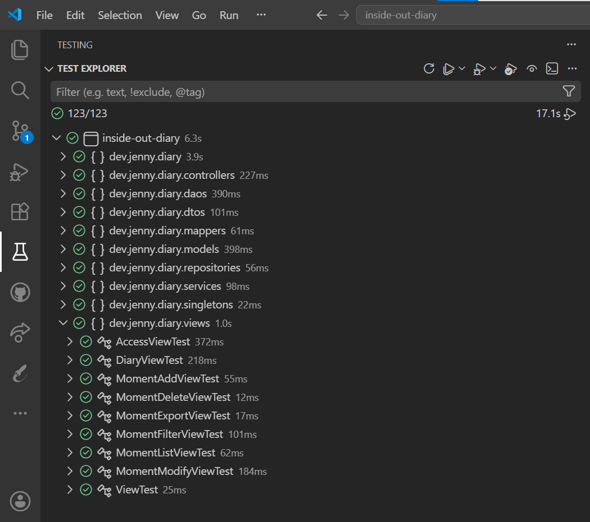 | 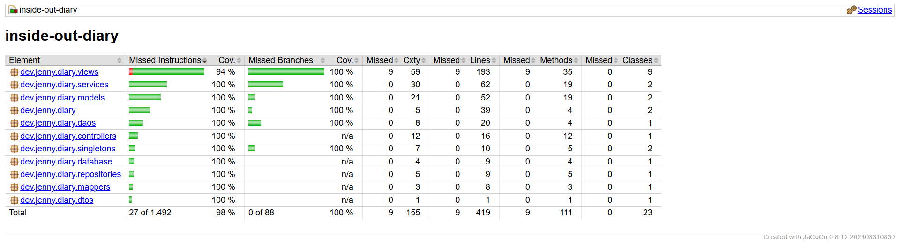 |

---

## 📑 Índice

- [Descripción](#-descripción)
- [Enunciado](#-enunciado)
- [Cómo reproducir el proyecto](#-cómo-reproducir-el-proyecto)
- [Estructura del repositorio](#-estructura-del-repositorio)
- [Historias de usuario y criterios de aceptación](#-historias-de-usuario-y-criterios-de-aceptación)
  - [Refinamiento](#-refinamiento-historias-adicionales)
- [Diagramas](#-diagramas)
- [Testing](#-testing)
- [Cobertura de tests](#-cobertura-de-tests-coverage)
- [Tecnologías](#-tecnologías)
- [Recursos](#-recursos)
- [Autora](#-autora)

---

## 📋 Descripción

**Inside Out Diary** es una aplicación de consola que funciona como un diario personal de emociones, protegido por contraseña. El usuario puede registrar cada momento vivido junto con la emoción que sintió y la fecha en que ocurrió, para después repasarlo, modificarlo, filtrarlo por emoción, mes o fecha exacta, exportarlo a CSV, o eliminarlo.

El proyecto pone en práctica:

- **Persistencia en memoria** con la interfaz `Map`.
- **Arquitectura por capas** con separación de responsabilidades (la _S_ de SOLID): modelo, repositorio, servicio (lógica) y presentación por consola.
- **TDD** (Red-Green-Refactor) sobre la lógica, con una cobertura mínima del 70 %.

---

## 📝 Enunciado

Crear una aplicación de consola, _Mi Diario_, con la que el usuario pueda gestionar los momentos vividos. Cada momento tiene una **emoción** asignada y la **fecha** en la que ocurrió.

Cada momento vivido tiene: identificador, título, descripción, emoción, fecha del momento, fecha de creación y fecha de modificación.

### Emociones disponibles

1. Alegría
2. Tristeza
3. Ira
4. Asco
5. Miedo
6. Ansiedad
7. Envidia
8. Vergüenza
9. Aburrimiento
10. Nostalgia

El enunciado incluye además **seis historias de usuario** (correspondientes a las **HU-01 a HU-06**) y, posteriormente, un **refinamiento** con **tres historias adicionales** (**HU-07 a HU-09**), dadas sin sus criterios de aceptación. Parte del ejercicio consiste precisamente en **redactar los criterios de aceptación y los escenarios** de cada historia, que se recogen en el apartado [Historias de usuario y criterios de aceptación](#-historias-de-usuario-y-criterios-de-aceptación).

**Requisitos de entrega:**

- Persistencia de datos en memoria mediante la interfaz `Map`.
- Código estructurado por capas, con correcta separación de responsabilidades (la _S_ de SOLID).
- Tests con una cobertura mínima del **70 %**, incluyendo la captura del informe de cobertura en el README.
- Tres diagramas: **diagrama UML de casos de uso**, **diagrama de secuencia** y **diagrama UML de clases**.
- README debidamente trabajado (descripción, pre-requisitos, pasos de instalación, ejecución de tests).

[Volver al índice](#-índice)

---

## 🚀 Cómo reproducir el proyecto

### Requisitos previos

- **[JDK 21](https://www.oracle.com/java/technologies/downloads/)** instalado — [guía de instalación](https://docs.oracle.com/en/java/javase/21/install/overview-jdk-installation.html)
- **[Apache Maven](https://maven.apache.org/download.cgi)** instalado y en el `PATH` — [guía de instalación](https://maven.apache.org/install.html)
- **[Git](https://git-scm.com/downloads)** para clonar el repositorio — [guía de instalación](https://git-scm.com/book/es/v2/Inicio---Sobre-el-Control-de-Versiones-Instalaci%C3%B3n-de-Git)

### Pasos

**1. Comprueba que tienes Java y Maven instalados** (si algún comando no se reconoce, instálalo desde los enlaces de _Requisitos previos_):

```bash
java --version
mvn --version
```

**2. Clona el repositorio:**

```bash
git clone https://github.com/Jennydev-25/inside-out-diary.git
```

**3. Entra en la carpeta del proyecto:**

```bash
cd inside-out-diary
```

**4. Ejecuta los tests** (compila y genera el reporte de cobertura de JaCoCo):

```bash
mvn test
```

El reporte de cobertura se genera en `target/site/jacoco/index.html`, que puedes abrir en el navegador.

**5. Ejecuta la aplicación:**

```bash
mvn exec:java
```

La aplicación pide una contraseña antes de dar acceso al diario. Usa `diary2026` por defecto, o el valor que configures en la variable de entorno `DIARY_PASSWORD`. **Solo hay tres intentos antes de que la aplicación se cierre.**

[Volver al índice](#-índice)

---

## 📁 Estructura del repositorio

```text
inside-out-diary/
├── assets/
│   └── images/
│       ├── diagrams/
│       │   └── use-case-diagram.png
│       ├── coverage/
│       │   └── coverage-jacoco.png
│       └── test-explorer/
│           ├── app.png
│           ├── controllers.png
│           ├── daos.png
│           ├── dtos-mappers.png
│           ├── models-emotion.png
│           ├── models-moment.png
│           ├── repositories.png
│           ├── services-access.png
│           ├── services-diary.png
│           ├── singletons.png
│           └── views.png
├── src/
│   ├── main/java/dev/jenny/diary/
│   │   ├── App.java
│   │   ├── contracts/
│   │   │   ├── InterfaceMomentCsvDao.java
│   │   │   └── InterfaceMomentRepository.java
│   │   ├── controllers/
│   │   │   └── DiaryController.java
│   │   ├── daos/
│   │   │   └── MomentCsvDao.java
│   │   ├── database/
│   │   │   └── MomentInMemoryDatabase.java
│   │   ├── dtos/
│   │   │   └── MomentDto.java
│   │   ├── mappers/
│   │   │   └── MomentMapper.java
│   │   ├── models/
│   │   │   ├── Emotion.java
│   │   │   └── Moment.java
│   │   ├── repositories/
│   │   │   └── MomentRepository.java
│   │   ├── services/
│   │   │   ├── AccessService.java
│   │   │   └── DiaryService.java
│   │   ├── singletons/
│   │   │   ├── AccessServiceSingleton.java
│   │   │   └── DiaryControllerSingleton.java
│   │   └── views/
│   │       ├── AccessView.java
│   │       ├── DiaryView.java
│   │       ├── MomentAddView.java
│   │       ├── MomentDeleteView.java
│   │       ├── MomentExportView.java
│   │       ├── MomentFilterView.java
│   │       ├── MomentListView.java
│   │       ├── MomentModifyView.java
│   │       └── View.java
│   └── test/java/dev/jenny/diary/
│       ├── AppTest.java
│       ├── controllers/
│       │   └── DiaryControllerTest.java
│       ├── daos/
│       │   └── MomentCsvDaoTest.java
│       ├── dtos/
│       │   └── MomentDtoTest.java
│       ├── mappers/
│       │   └── MomentMapperTest.java
│       ├── mocks/
│       │   ├── FakeMomentCsvDao.java
│       │   └── FakeMomentRepository.java
│       ├── models/
│       │   ├── EmotionTest.java
│       │   └── MomentTest.java
│       ├── repositories/
│       │   └── MomentRepositoryTest.java
│       ├── services/
│       │   ├── AccessServiceTest.java
│       │   └── DiaryServiceTest.java
│       ├── singletons/
│       │   └── AccessServiceSingletonTest.java
│       └── views/
│           ├── AccessViewTest.java
│           ├── DiaryViewTest.java
│           ├── MomentAddViewTest.java
│           ├── MomentDeleteViewTest.java
│           ├── MomentExportViewTest.java
│           ├── MomentFilterViewTest.java
│           ├── MomentListViewTest.java
│           ├── MomentModifyViewTest.java
│           └── ViewTest.java
├── .editorconfig
├── .gitignore
├── pom.xml
└── README.md
```

[Volver al índice](#-índice)

---

## 👤 Historias de usuario y criterios de aceptación

Estas son las historias de usuario del proyecto con sus criterios de aceptación. Las **HU-01 a HU-06** corresponden al enunciado base y las **HU-07 a HU-09** al refinamiento. Cada historia recoge sus escenarios en formato Gherkin (**Dado / Cuando / Entonces**), desplegables en «Criterios de aceptación».

### HU-01 — Añadir un momento vivido

- **Como** usuario
- **Quiero** añadir un momento vivido con su título, descripción, emoción y fecha
- **Para** poder recordarlo cuando lo necesite

<details>
<summary>Criterios de aceptación</summary>

- **Escenario 1: Añadir un momento con datos válidos**
  - **Dado** que estoy en el menú principal
  - **Cuando** selecciono "Añadir momento" e introduzco un título, una fecha válida (dd/mm/aaaa), una descripción y una emoción del 1 al 10
  - **Entonces** el momento se guarda con un identificador único y sus fechas de creación y modificación, y se muestra "Momento vivído añadido correctamente."
- **Escenario 2: Fecha con formato inválido**
  - **Dado** que estoy añadiendo un momento
  - **Cuando** introduzco la fecha en un formato distinto de dd/mm/aaaa
  - **Entonces** el momento no se guarda y se muestra un mensaje de error indicando el formato correcto
- **Escenario 3: Emoción fuera de rango**
  - **Dado** que estoy añadiendo un momento
  - **Cuando** selecciono una emoción que no está entre 1 y 10
  - **Entonces** el momento no se guarda y se muestra un mensaje de error

</details>

### HU-02 — Ver todos los momentos

- **Como** usuario
- **Quiero** recuperar la lista de los momentos registrados
- **Para** poder repasarlos

<details>
<summary>Criterios de aceptación</summary>

- **Escenario 1: Listar momentos existentes**
  - **Dado** que hay al menos un momento registrado
  - **Cuando** selecciono "Ver todos los momentos disponibles"
  - **Entonces** se muestra la lista con identificador, fecha, título, descripción y emoción de cada momento
- **Escenario 2: Listar cuando no hay momentos**
  - **Dado** que no hay ningún momento registrado
  - **Cuando** selecciono "Ver todos los momentos disponibles"
  - **Entonces** se muestra un mensaje indicando que todavía no hay momentos registrados

</details>

### HU-03 — Eliminar un momento

- **Como** usuario
- **Quiero** suprimir un momento vivido
- **Para** evitar duplicados y mantener la lista organizada

<details>
<summary>Criterios de aceptación</summary>

- **Escenario 1: Eliminar un momento existente**
  - **Dado** que existe un momento con identificador 1
  - **Cuando** selecciono "Eliminar un momento" e introduzco el identificador 1
  - **Entonces** el momento se elimina y se muestra "Momento vivído eliminado correctamente."
- **Escenario 2: Eliminar un identificador inexistente**
  - **Dado** que no existe ningún momento con identificador 99
  - **Cuando** introduzco el identificador 99 para eliminar
  - **Entonces** no se elimina nada y se muestra un mensaje indicando que no existe un momento con ese identificador
- **Escenario 3: Identificador no numérico**
  - **Dado** que estoy eliminando un momento
  - **Cuando** introduzco un identificador que no es un número
  - **Entonces** se muestra un mensaje de error y no se elimina nada

</details>

### HU-04 — Filtrar por emoción

- **Como** usuario
- **Quiero** obtener los momentos vividos según su emoción
- **Para** poder visualizarlos agrupados por lo que sentí

<details>
<summary>Criterios de aceptación</summary>

- **Escenario 1: Filtrar por una emoción con resultados**
  - **Dado** que existen momentos con la emoción "Alegría"
  - **Cuando** selecciono "Filtrar los momentos", elijo filtrar por emoción y selecciono "Alegría"
  - **Entonces** se muestran únicamente los momentos con emoción Alegría
- **Escenario 2: Filtrar por una emoción sin resultados**
  - **Dado** que no existe ningún momento con la emoción "Envidia"
  - **Cuando** filtro por la emoción "Envidia"
  - **Entonces** se muestra un mensaje indicando que no hay momentos con esa emoción
- **Escenario 3: Emoción fuera de rango**
  - **Dado** que estoy filtrando por emoción
  - **Cuando** selecciono una opción que no está entre 1 y 10
  - **Entonces** se muestra un mensaje de error

</details>

### HU-05 — Filtrar por mes

- **Como** usuario
- **Quiero** obtener los momentos vividos en un mes determinado
- **Para** poder repasar lo que viví ese mes

<details>
<summary>Criterios de aceptación</summary>

- **Escenario 1: Filtrar por un mes con resultados**
  - **Dado** que existen momentos con fecha en mayo de 2024
  - **Cuando** selecciono "Filtrar los momentos", elijo filtrar por fecha e indico el mes "05/2024"
  - **Entonces** se muestran únicamente los momentos ocurridos en mayo de 2024
- **Escenario 2: Filtrar por un mes sin resultados**
  - **Dado** que no existe ningún momento en el mes indicado
  - **Cuando** filtro por el mes "01/2020"
  - **Entonces** se muestra un mensaje indicando que no hay momentos en ese mes
- **Escenario 3: Mes inválido**
  - **Dado** que estoy filtrando por mes
  - **Cuando** introduzco un mes fuera de 1–12 o con formato incorrecto
  - **Entonces** se muestra un mensaje de error

</details>

### HU-06 — Salir del programa

- **Como** usuario
- **Quiero** salir del programa
- **Para** poder cerrarlo o iniciar otro

<details>
<summary>Criterios de aceptación</summary>

- **Escenario 1: Salir del programa**
  - **Dado** que estoy en el menú principal
  - **Cuando** selecciono "Salir"
  - **Entonces** se muestra "Hasta la próxima!!!" y el programa termina de forma ordenada

</details>

[Volver al índice](#-índice)

---

### ✨ Refinamiento (historias adicionales)

Historias planteadas en la fase de **refinamiento** del proyecto; siguen el mismo formato de criterios de aceptación y escenarios.

### HU-07 — Modificar un momento vivido

- **Como** usuario
- **Quiero** modificar cualquier dato de un momento vivido (título, descripción, emoción o fecha del momento)
- **Para** mantener mi diario actualizado cuando necesite corregir o ampliar información

<details>
<summary>Criterios de aceptación</summary>

- **Escenario 1: Modificar la emoción de un momento existente**
  - **Dado** que existe un momento con identificador 1 y emoción "Tristeza"
  - **Cuando** selecciono modificar el momento 1 y cambio la emoción a "Alegría"
  - **Entonces** el momento pasa a tener emoción Alegría y se actualiza su fecha de modificación, manteniendo su identificador y su fecha de creación
- **Escenario 2: Modificar un momento inexistente**
  - **Dado** que no existe ningún momento con identificador 50
  - **Cuando** intento modificar el momento 50
  - **Entonces** no se modifica nada y se muestra un mensaje indicando que no existe ese momento

</details>

### HU-08 — Exportar los momentos a CSV

- **Como** usuario
- **Quiero** generar la lista completa de momentos vividos en un archivo CSV
- **Para** guardar, compartir o analizar mis recuerdos fuera de la aplicación

<details>
<summary>Criterios de aceptación</summary>

- **Escenario 1: Exportar momentos a CSV**
  - **Dado** que hay momentos registrados
  - **Cuando** selecciono la opción de exportar a CSV
  - **Entonces** se genera un archivo .csv con una fila de cabecera y una fila por momento, y se muestra la ruta del archivo generado
- **Escenario 2: Exportar cuando no hay momentos**
  - **Dado** que no hay ningún momento registrado
  - **Cuando** selecciono la opción de exportar a CSV
  - **Entonces** se muestra un mensaje indicando que no hay momentos que exportar

</details>

### HU-09 — Acceso protegido por contraseña

- **Como** usuario
- **Quiero** acceder a mi diario únicamente mediante una contraseña
- **Para** asegurar que mis momentos estén protegidos y solo yo pueda consultarlos

<details>
<summary>Criterios de aceptación</summary>

- **Escenario 1: Acceso con contraseña correcta**
  - **Dado** que la aplicación está protegida por contraseña
  - **Cuando** introduzco la contraseña correcta
  - **Entonces** accedo al menú principal del diario
- **Escenario 2: Acceso con contraseña incorrecta**
  - **Dado** que la aplicación está protegida por contraseña
  - **Cuando** introduzco una contraseña incorrecta
  - **Entonces** se me deniega el acceso y se me permite reintentar hasta agotar el número máximo de intentos
- **Escenario 3: Denegación definitiva por intentos agotados**
  - **Dado** que he agotado los intentos permitidos
  - **Cuando** intento acceder de nuevo
  - **Entonces** se me deniega el acceso y la aplicación se cierra

</details>

[Volver al índice](#-índice)

---

## 📐 Diagramas

Estos tres tipos de diagramas UML muestran la aplicación desde tres ángulos distintos: qué puede hacer el usuario, cómo fluye una acción real por las capas y cómo se relacionan las clases entre sí

<details>
<summary>Diagrama de casos de uso</summary>

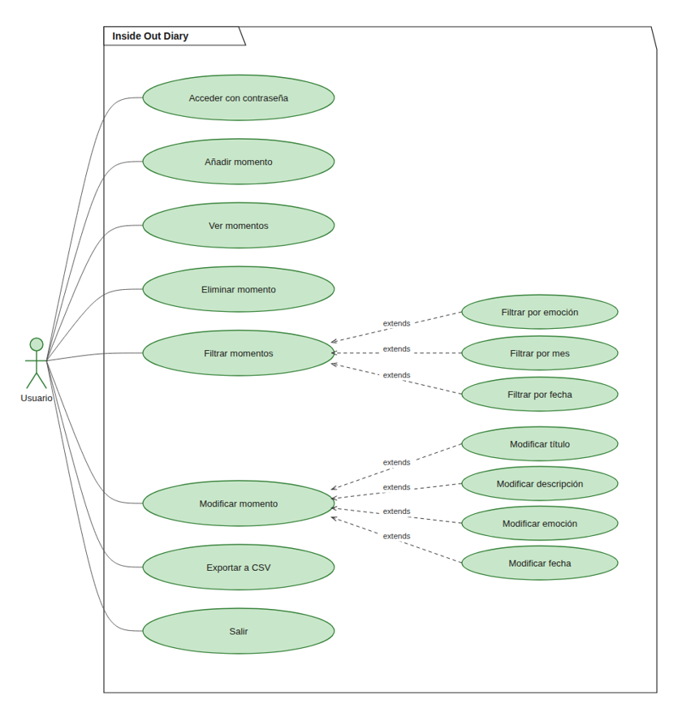

Un caso de uso por historia de usuario, con `<<extend>>` para las 3 formas de filtrar (emoción, mes, fecha) y las 4 de modificar (título, descripción, emoción, fecha)

</details>

<details>
<summary>Diagrama de secuencia — Acceder con contraseña</summary>

Los tres caminos posibles al iniciar la aplicación: contraseña correcta, incorrecta con intentos restantes, e incorrecta con los intentos agotados

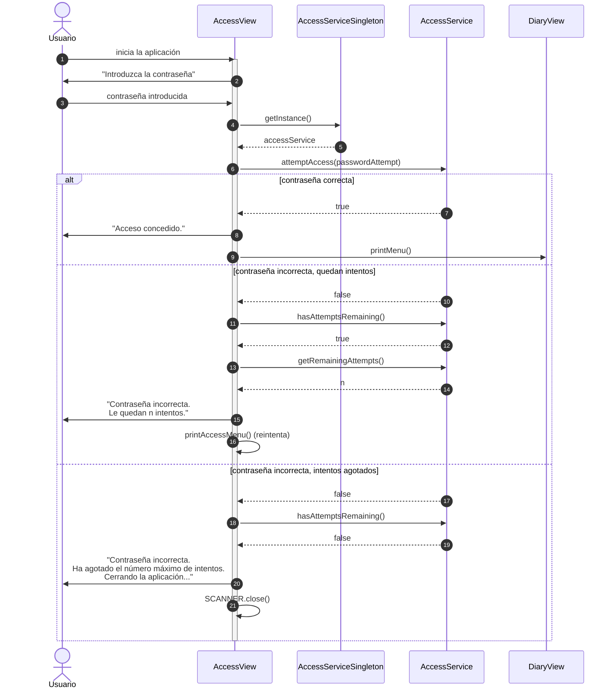
```mermaid
sequenceDiagram
    autonumber
    actor Usuario
    participant AccessView
    participant AccessServiceSingleton
    participant AccessService
    participant DiaryView

    Usuario->>AccessView: inicia la aplicación
    activate AccessView
    AccessView->>Usuario: "Introduzca la contraseña"
    Usuario->>AccessView: contraseña introducida
    AccessView->>AccessServiceSingleton: getInstance()
    AccessServiceSingleton-->>AccessView: accessService
    AccessView->>AccessService: attemptAccess(passwordAttempt)

    alt contraseña correcta
        AccessService-->>AccessView: true
        AccessView->>Usuario: "Acceso concedido."
        AccessView->>DiaryView: printMenu()
    else contraseña incorrecta, quedan intentos
        AccessService-->>AccessView: false
        AccessView->>AccessService: hasAttemptsRemaining()
        AccessService-->>AccessView: true
        AccessView->>AccessService: getRemainingAttempts()
        AccessService-->>AccessView: n
        AccessView->>Usuario: "Contraseña incorrecta.<br/>Le quedan n intentos."
        AccessView->>AccessView: printAccessMenu() (reintenta)
    else contraseña incorrecta, intentos agotados
        AccessService-->>AccessView: false
        AccessView->>AccessService: hasAttemptsRemaining()
        AccessService-->>AccessView: false
        AccessView->>Usuario: "Contraseña incorrecta.<br/>Ha agotado el número máximo de intentos.<br/>Cerrando la aplicación..."
        AccessView->>AccessView: SCANNER.close()
    end
    deactivate AccessView
```

</details>

<details>
<summary>Diagrama de secuencia — Añadir un momento</summary>

Recorre las capas completas: Vista → Controlador → Servicio → Mapper → Repositorio → Base de datos

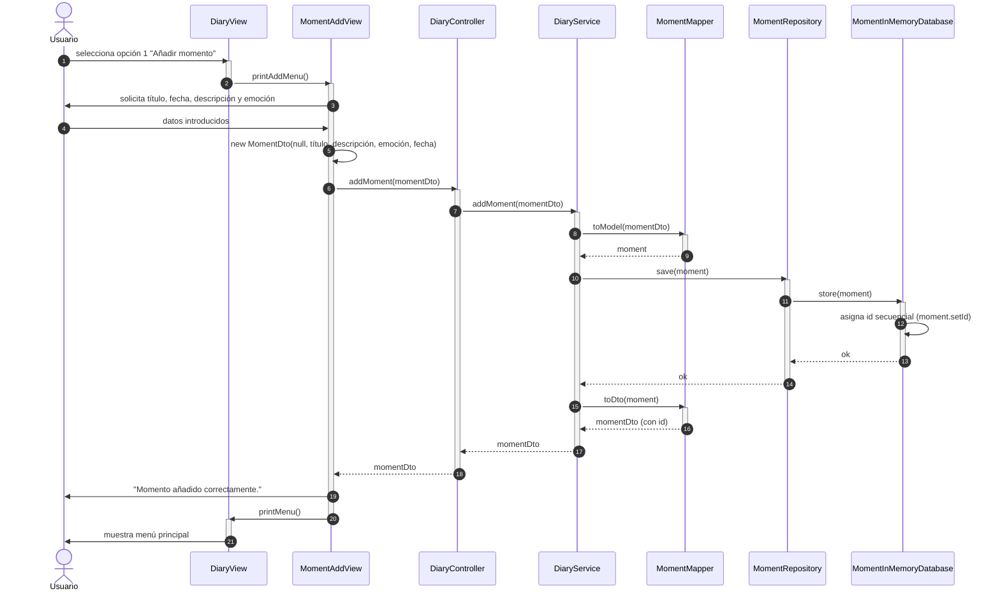
```mermaid
sequenceDiagram
    autonumber
    actor Usuario
    participant DiaryView
    participant MomentAddView
    participant DiaryController
    participant DiaryService
    participant MomentMapper
    participant MomentRepository
    participant MomentInMemoryDatabase

    Usuario->>DiaryView: selecciona opción 1 "Añadir momento"
    activate DiaryView
    DiaryView->>MomentAddView: printAddMenu()
    deactivate DiaryView
    activate MomentAddView
    MomentAddView->>Usuario: solicita título, fecha, descripción y emoción
    Usuario->>MomentAddView: datos introducidos
    MomentAddView->>MomentAddView: new MomentDto(null, título, descripción, emoción, fecha)
    MomentAddView->>DiaryController: addMoment(momentDto)
    activate DiaryController
    DiaryController->>DiaryService: addMoment(momentDto)
    activate DiaryService
    DiaryService->>MomentMapper: toModel(momentDto)
    activate MomentMapper
    MomentMapper-->>DiaryService: moment
    deactivate MomentMapper
    DiaryService->>MomentRepository: save(moment)
    activate MomentRepository
    MomentRepository->>MomentInMemoryDatabase: store(moment)
    activate MomentInMemoryDatabase
    MomentInMemoryDatabase->>MomentInMemoryDatabase: asigna id secuencial (moment.setId)
    MomentInMemoryDatabase-->>MomentRepository: ok
    deactivate MomentInMemoryDatabase
    MomentRepository-->>DiaryService: ok
    deactivate MomentRepository
    DiaryService->>MomentMapper: toDto(moment)
    activate MomentMapper
    MomentMapper-->>DiaryService: momentDto (con id)
    deactivate MomentMapper
    DiaryService-->>DiaryController: momentDto
    deactivate DiaryService
    DiaryController-->>MomentAddView: momentDto
    deactivate DiaryController
    MomentAddView->>Usuario: "Momento añadido correctamente."
    MomentAddView->>DiaryView: printMenu()
    deactivate MomentAddView
    activate DiaryView
    DiaryView->>Usuario: muestra menú principal
    deactivate DiaryView
```

</details>

<details>
<summary>Diagrama de secuencia — Eliminar un momento</summary>

Muestra el camino feliz y el de excepción (`DiaryService.findMomentOrThrow`, reutilizado también en `updateMoment*`)

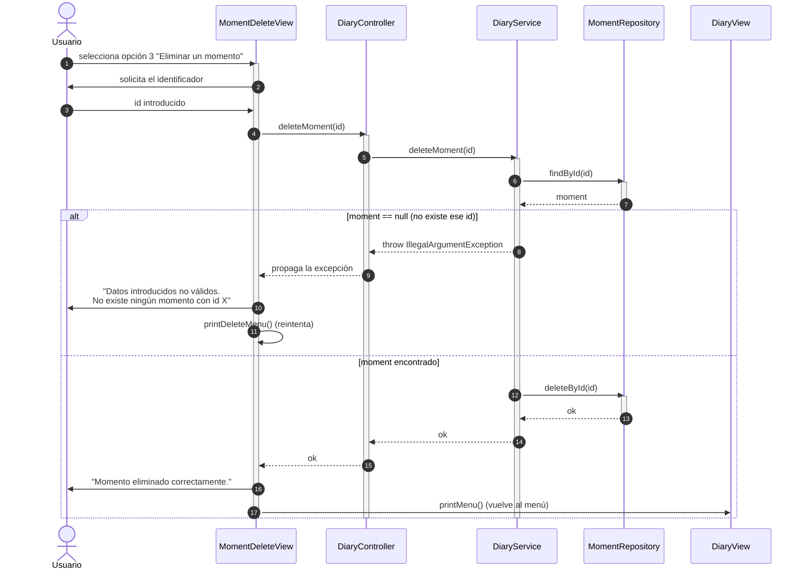
```mermaid
sequenceDiagram
    autonumber
    actor Usuario
    participant MomentDeleteView
    participant DiaryController
    participant DiaryService
    participant MomentRepository
    participant DiaryView

    Usuario->>MomentDeleteView: selecciona opción 3 "Eliminar un momento"
    activate MomentDeleteView
    MomentDeleteView->>Usuario: solicita el identificador
    Usuario->>MomentDeleteView: id introducido
    MomentDeleteView->>DiaryController: deleteMoment(id)
    activate DiaryController
    DiaryController->>DiaryService: deleteMoment(id)
    activate DiaryService
    DiaryService->>MomentRepository: findById(id)
    activate MomentRepository
    MomentRepository-->>DiaryService: moment
    deactivate MomentRepository

    alt moment == null (no existe ese id)
        DiaryService-->>DiaryController: throw IllegalArgumentException
        DiaryController-->>MomentDeleteView: propaga la excepción
        MomentDeleteView->>Usuario: "Datos introducidos no válidos.<br/>No existe ningún momento con id X"
        MomentDeleteView->>MomentDeleteView: printDeleteMenu() (reintenta)
    else moment encontrado
        DiaryService->>MomentRepository: deleteById(id)
        activate MomentRepository
        MomentRepository-->>DiaryService: ok
        deactivate MomentRepository
        DiaryService-->>DiaryController: ok
        DiaryController-->>MomentDeleteView: ok
        MomentDeleteView->>Usuario: "Momento eliminado correctamente."
        MomentDeleteView->>DiaryView: printMenu() (vuelve al menú)
    end

    deactivate DiaryService
    deactivate DiaryController
    deactivate MomentDeleteView
```

</details>

<details>
<summary>Diagrama de secuencia — Filtrar los momentos</summary>

Las tres formas de filtrar (emoción, mes, fecha) más el camino de opción fuera de rango.

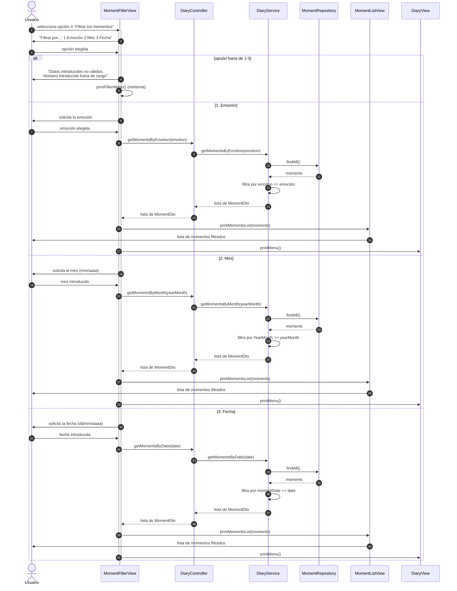
```mermaid
sequenceDiagram
    autonumber
    actor Usuario
    participant MomentFilterView
    participant DiaryController
    participant DiaryService
    participant MomentRepository
    participant MomentListView
    participant DiaryView

    Usuario->>MomentFilterView: selecciona opción 4 "Filtrar los momentos"
    activate MomentFilterView
    MomentFilterView->>Usuario: "Filtrar por...: 1.Emoción 2.Mes 3.Fecha"
    Usuario->>MomentFilterView: opción elegida

    alt opción fuera de 1-3
        MomentFilterView->>Usuario: "Datos introducidos no válidos.<br/>Número introducido fuera de rango"
        MomentFilterView->>MomentFilterView: printFilterMenu() (reintenta)
    else 1. Emoción
        MomentFilterView->>Usuario: solicita la emoción
        Usuario->>MomentFilterView: emoción elegida
        MomentFilterView->>DiaryController: getMomentsByEmotion(emotion)
        DiaryController->>DiaryService: getMomentsByEmotion(emotion)
        DiaryService->>MomentRepository: findAll()
        MomentRepository-->>DiaryService: moments
        DiaryService->>DiaryService: filtra por emotion == emoción
        DiaryService-->>DiaryController: lista de MomentDto
        DiaryController-->>MomentFilterView: lista de MomentDto
        MomentFilterView->>MomentListView: printMomentsList(moments)
        MomentListView->>Usuario: lista de momentos filtrados
        MomentFilterView->>DiaryView: printMenu()
    else 2. Mes
        MomentFilterView->>Usuario: solicita el mes (mm/aaaa)
        Usuario->>MomentFilterView: mes introducido
        MomentFilterView->>DiaryController: getMomentsByMonth(yearMonth)
        DiaryController->>DiaryService: getMomentsByMonth(yearMonth)
        DiaryService->>MomentRepository: findAll()
        MomentRepository-->>DiaryService: moments
        DiaryService->>DiaryService: filtra por YearMonth == yearMonth
        DiaryService-->>DiaryController: lista de MomentDto
        DiaryController-->>MomentFilterView: lista de MomentDto
        MomentFilterView->>MomentListView: printMomentsList(moments)
        MomentListView->>Usuario: lista de momentos filtrados
        MomentFilterView->>DiaryView: printMenu()
    else 3. Fecha
        MomentFilterView->>Usuario: solicita la fecha (dd/mm/aaaa)
        Usuario->>MomentFilterView: fecha introducida
        MomentFilterView->>DiaryController: getMomentsByDate(date)
        DiaryController->>DiaryService: getMomentsByDate(date)
        DiaryService->>MomentRepository: findAll()
        MomentRepository-->>DiaryService: moments
        DiaryService->>DiaryService: filtra por momentDate == date
        DiaryService-->>DiaryController: lista de MomentDto
        DiaryController-->>MomentFilterView: lista de MomentDto
        MomentFilterView->>MomentListView: printMomentsList(moments)
        MomentListView->>Usuario: lista de momentos filtrados
        MomentFilterView->>DiaryView: printMenu()
    end
    deactivate MomentFilterView
```

</details>

<details>
<summary>Diagrama de secuencia — Modificar un momento</summary>

Mismo patrón de validación que Filtrar (opción fuera de rango) y mismo patrón de error que Eliminar (`findMomentOrThrow`). `updateMomentX`/`setX` representan los 4 pares reales según el campo elegido (`updateMomentTitle`/`setTitle`, `updateMomentDescription`/`setDescription`, `updateMomentEmotion`/`setEmotion`, `updateMomentDate`/`setMomentDate`)

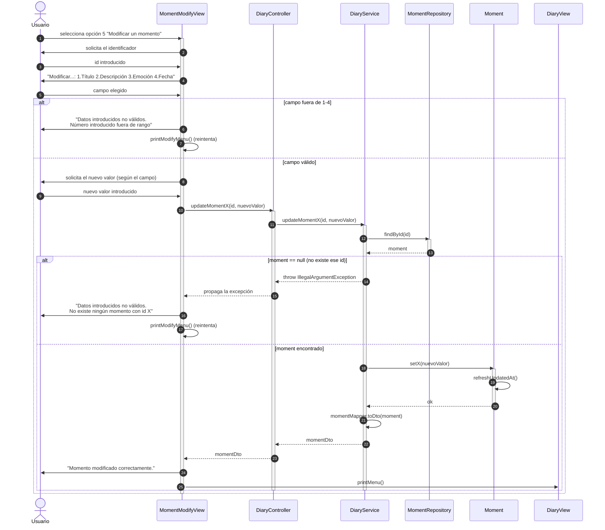
```mermaid
sequenceDiagram
    autonumber
    actor Usuario
    participant MomentModifyView
    participant DiaryController
    participant DiaryService
    participant MomentRepository
    participant Moment
    participant DiaryView

    Usuario->>MomentModifyView: selecciona opción 5 "Modificar un momento"
    activate MomentModifyView
    MomentModifyView->>Usuario: solicita el identificador
    Usuario->>MomentModifyView: id introducido
    MomentModifyView->>Usuario: "Modificar...: 1.Título 2.Descripción 3.Emoción 4.Fecha"
    Usuario->>MomentModifyView: campo elegido

    alt campo fuera de 1-4
        MomentModifyView->>Usuario: "Datos introducidos no válidos.<br/>Número introducido fuera de rango"
        MomentModifyView->>MomentModifyView: printModifyMenu() (reintenta)
    else campo válido
        MomentModifyView->>Usuario: solicita el nuevo valor (según el campo)
        Usuario->>MomentModifyView: nuevo valor introducido

        MomentModifyView->>DiaryController: updateMomentX(id, nuevoValor)
        activate DiaryController
        DiaryController->>DiaryService: updateMomentX(id, nuevoValor)
        activate DiaryService
        DiaryService->>MomentRepository: findById(id)
        activate MomentRepository
        MomentRepository-->>DiaryService: moment
        deactivate MomentRepository

        alt moment == null (no existe ese id)
            DiaryService-->>DiaryController: throw IllegalArgumentException
            DiaryController-->>MomentModifyView: propaga la excepción
            MomentModifyView->>Usuario: "Datos introducidos no válidos.<br/>No existe ningún momento con id X"
            MomentModifyView->>MomentModifyView: printModifyMenu() (reintenta)
        else moment encontrado
            DiaryService->>Moment: setX(nuevoValor)
            activate Moment
            Moment->>Moment: refreshUpdatedAt()
            Moment-->>DiaryService: ok
            deactivate Moment
            DiaryService->>DiaryService: momentMapper.toDto(moment)
            DiaryService-->>DiaryController: momentDto
            DiaryController-->>MomentModifyView: momentDto
            MomentModifyView->>Usuario: "Momento modificado correctamente."
            MomentModifyView->>DiaryView: printMenu()
        end

        deactivate DiaryService
        deactivate DiaryController
    end

    deactivate MomentModifyView
```

</details>

<details>
<summary>Diagrama de clases</summary>

Arquitectura en capas completa: Vista → Controlador → Servicio → Mapper/Repositorio (+ DAO para CSV) → Base de datos, con los dos Singleton (`AccessServiceSingleton` eager, `DiaryControllerSingleton` lazy) y el patrón DTO+Mapper entre `Moment` y `MomentDto`

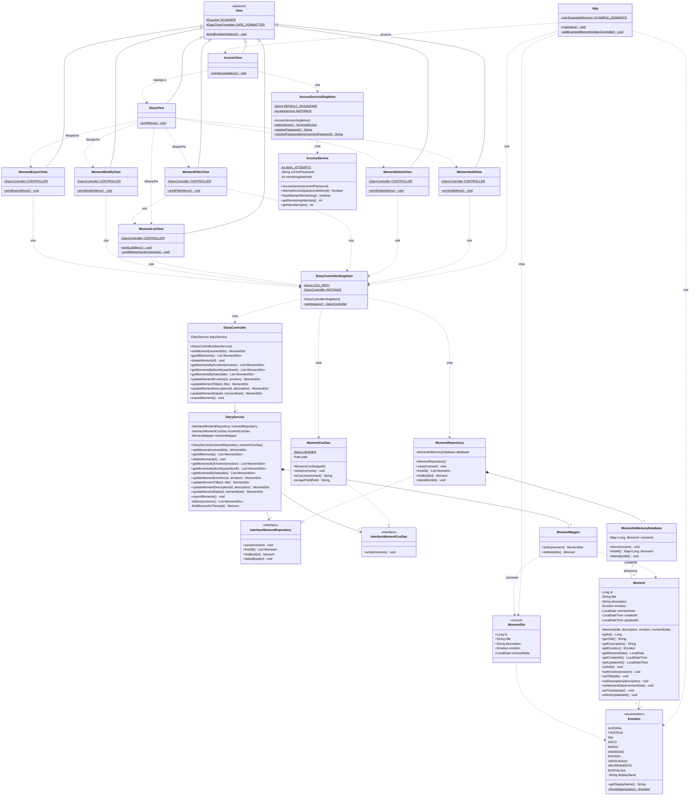
```mermaid
classDiagram
direction TB

class App {
    -List~ExampleMoment~ EXAMPLE_MOMENTS$
    +main(args)$ void
    ~addExampleMoments(diaryController)$ void
}

class View {
    <<abstract>>
    #Scanner SCANNER$
    #DateTimeFormatter DATE_FORMATTER$
    #printEmotionOptions()$ void
}
class AccessView {
    +printAccessMenu()$ void
}
class DiaryView {
    +printMenu()$ void
}
class MomentAddView {
    -DiaryController CONTROLLER$
    +printAddMenu()$ void
}
class MomentDeleteView {
    -DiaryController CONTROLLER$
    +printDeleteMenu()$ void
}
class MomentFilterView {
    -DiaryController CONTROLLER$
    +printFilterMenu()$ void
}
class MomentListView {
    -DiaryController CONTROLLER$
    +printListMenu()$ void
    ~printMomentsList(moments)$ void
}
class MomentModifyView {
    -DiaryController CONTROLLER$
    +printModifyMenu()$ void
}
class MomentExportView {
    -DiaryController CONTROLLER$
    +printExportMenu()$ void
}

class DiaryControllerSingleton {
    -String CSV_PATH$
    -DiaryController INSTANCE$
    -DiaryControllerSingleton()
    +getInstance()$ DiaryController
}
class AccessServiceSingleton {
    -String DEFAULT_PASSWORD$
    -AccessService INSTANCE$
    -AccessServiceSingleton()
    +getInstance()$ AccessService
    ~resolvePassword()$ String
    ~resolvePassword(environmentPassword)$ String
}

class DiaryController {
    -DiaryService diaryService
    +DiaryController(diaryService)
    +addMoment(momentDto) MomentDto
    +getAllMoments() List~MomentDto~
    +deleteMoment(id) void
    +getMomentsByEmotion(emotion) List~MomentDto~
    +getMomentsByMonth(yearMonth) List~MomentDto~
    +getMomentsByDate(date) List~MomentDto~
    +updateMomentEmotion(id, emotion) MomentDto
    +updateMomentTitle(id, title) MomentDto
    +updateMomentDescription(id, description) MomentDto
    +updateMomentDate(id, momentDate) MomentDto
    +exportMoments() void
}

class DiaryService {
    -InterfaceMomentRepository momentRepository
    -InterfaceMomentCsvDao momentCsvDao
    -MomentMapper momentMapper
    +DiaryService(momentRepository, momentCsvDao)
    +addMoment(momentDto) MomentDto
    +getAllMoments() List~MomentDto~
    +deleteMoment(id) void
    +getMomentsByEmotion(emotion) List~MomentDto~
    +getMomentsByMonth(yearMonth) List~MomentDto~
    +getMomentsByDate(date) List~MomentDto~
    +updateMomentEmotion(id, emotion) MomentDto
    +updateMomentTitle(id, title) MomentDto
    +updateMomentDescription(id, description) MomentDto
    +updateMomentDate(id, momentDate) MomentDto
    +exportMoments() void
    -toDtos(moments) List~MomentDto~
    -findMomentOrThrow(id) Moment
}
class AccessService {
    -int MAX_ATTEMPTS$
    -String correctPassword
    -int remainingAttempts
    +AccessService(correctPassword)
    +attemptAccess(passwordAttempt) boolean
    +hasAttemptsRemaining() boolean
    +getRemainingAttempts() int
    +getMaxAttempts() int
}

class InterfaceMomentRepository {
    <<interface>>
    +save(moment) void
    +findAll() List~Moment~
    +findById(id) Moment
    +deleteById(id) void
}
class InterfaceMomentCsvDao {
    <<interface>>
    +write(moments) void
}

class MomentRepository {
    -MomentInMemoryDatabase database
    +MomentRepository()
    +save(moment) void
    +findAll() List~Moment~
    +findById(id) Moment
    +deleteById(id) void
}

class MomentInMemoryDatabase {
    -Map~Long, Moment~ moments
    +store(moment) void
    +findAll() Map~Long, Moment~
    +deleteById(id) void
}

class MomentCsvDao {
    -String HEADER$
    -Path path
    +MomentCsvDao(path)
    +write(moments) void
    -toCsvLine(moment) String
    -escapeField(field) String
}

class MomentMapper {
    +toDto(moment) MomentDto
    +toModel(dto) Moment
}

class MomentDto {
    <<record>>
    +Long id
    +String title
    +String description
    +Emotion emotion
    +LocalDate momentDate
}

class Moment {
    -Long id
    -String title
    -String description
    -Emotion emotion
    -LocalDate momentDate
    -LocalDateTime createdAt
    -LocalDateTime updatedAt
    +Moment(title, description, emotion, momentDate)
    +getId() Long
    +getTitle() String
    +getDescription() String
    +getEmotion() Emotion
    +getMomentDate() LocalDate
    +getCreatedAt() LocalDateTime
    +getUpdatedAt() LocalDateTime
    +setId(id) void
    +setEmotion(emotion) void
    +setTitle(title) void
    +setDescription(description) void
    +setMomentDate(momentDate) void
    -setTimestamps() void
    -refreshUpdatedAt() void
}
class Emotion {
    <<enumeration>>
    ALEGRIA
    TRISTEZA
    IRA
    ASCO
    MIEDO
    ANSIEDAD
    ENVIDIA
    VERGUENZA
    ABURRIMIENTO
    NOSTALGIA
    -String displayName
    +getDisplayName() String
    +fromOption(option)$ Emotion
}

%% ---- Relaciones ----
View <|-- AccessView
View <|-- DiaryView
View <|-- MomentAddView
View <|-- MomentDeleteView
View <|-- MomentFilterView
View <|-- MomentListView
View <|-- MomentModifyView
View <|-- MomentExportView

App ..> AccessView : arranca
App ..> DiaryControllerSingleton : usa
App ..> MomentDto : crea
App ..> Emotion : usa

AccessView ..> AccessServiceSingleton : usa
AccessView ..> DiaryView : navega a

DiaryView ..> MomentAddView : despacha
DiaryView ..> MomentDeleteView : despacha
DiaryView ..> MomentFilterView : despacha
DiaryView ..> MomentListView : despacha
DiaryView ..> MomentModifyView : despacha
DiaryView ..> MomentExportView : despacha

MomentFilterView ..> MomentListView : usa
MomentAddView ..> DiaryControllerSingleton : usa
MomentDeleteView ..> DiaryControllerSingleton : usa
MomentFilterView ..> DiaryControllerSingleton : usa
MomentListView ..> DiaryControllerSingleton : usa
MomentModifyView ..> DiaryControllerSingleton : usa
MomentExportView ..> DiaryControllerSingleton : usa

DiaryControllerSingleton ..> DiaryController : crea
DiaryControllerSingleton ..> MomentRepository : crea
DiaryControllerSingleton ..> MomentCsvDao : crea
AccessServiceSingleton ..> AccessService : crea

DiaryController --> "1" DiaryService

MomentRepository ..|> InterfaceMomentRepository
MomentCsvDao ..|> InterfaceMomentCsvDao

DiaryService --> "1" InterfaceMomentRepository
DiaryService --> "1" InterfaceMomentCsvDao
DiaryService *-- "1" MomentMapper

MomentMapper ..> Moment : convierte
MomentMapper ..> MomentDto : convierte

MomentRepository *-- "1" MomentInMemoryDatabase
MomentInMemoryDatabase "1" o-- "0..*" Moment : almacena

Moment "1" --> "1" Emotion
MomentDto ..> Emotion
```

</details>

[Volver al índice](#-índice)

---

## 🧪 Testing

Siguiendo TDD (Red-Green-Refactor), cada capa se testea con la herramienta que mejor encaja (JUnit 5 y Hamcrest en todos los casos, sumando Mockito o Fakes propios donde lo encontré necesario)

<details>
<summary>Ver capturas del Test Explorer por capa</summary>

|                     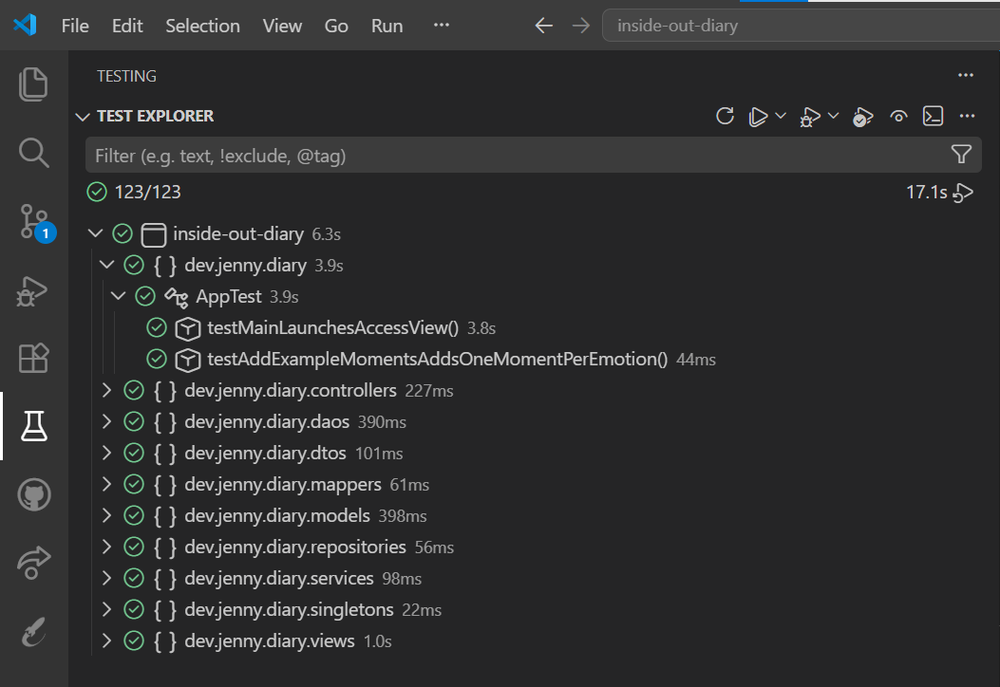<br>**App**                     |                   <br>**Views**                    |
| :--------------------------------------------------------------------------------------------------: | :-----------------------------------------------------------------------------------------------------: |
|         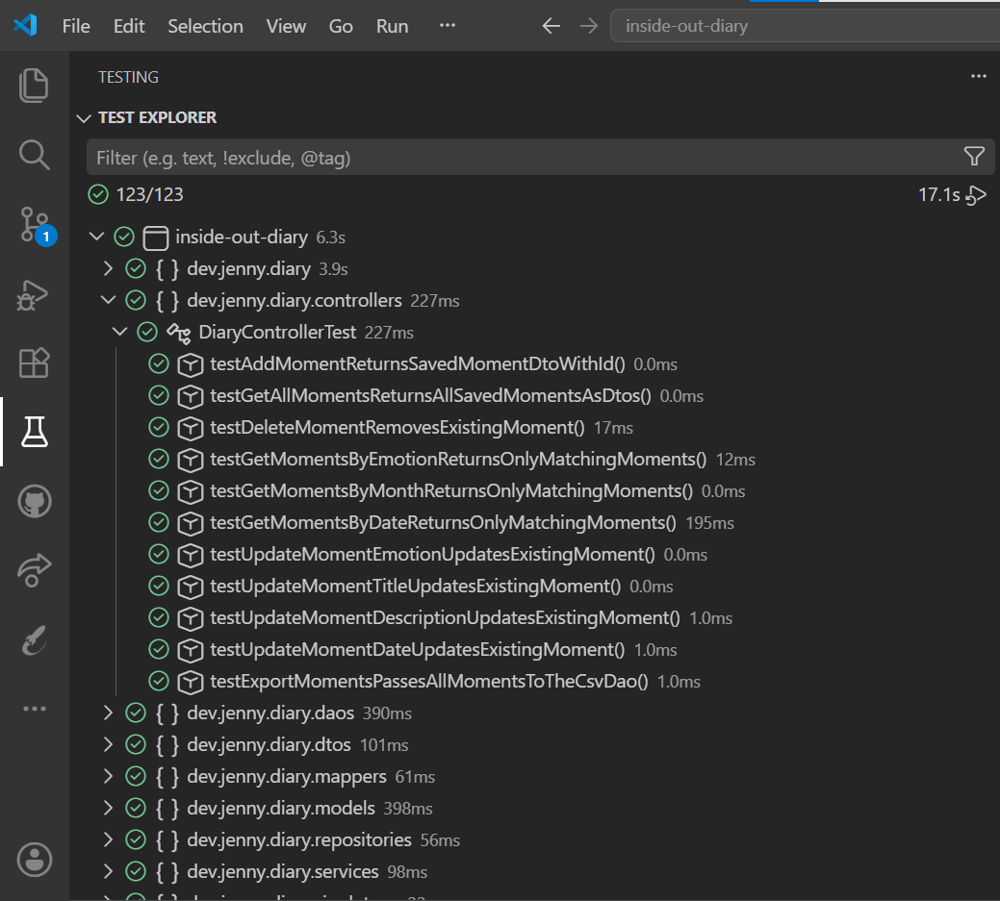<br>**Controllers**         | 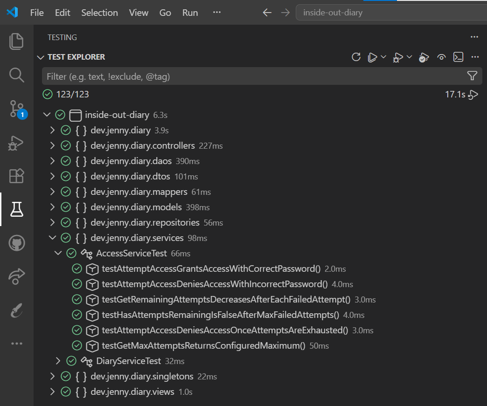<br>**Services · AccessService** |
| 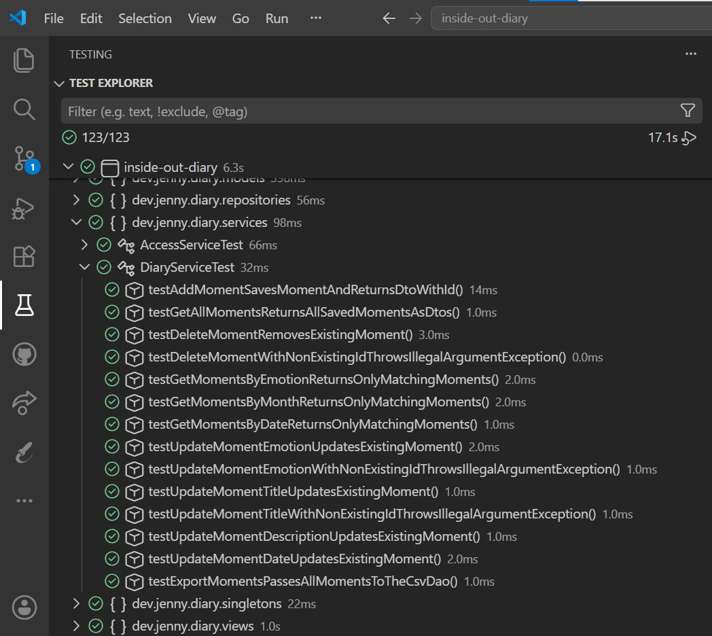<br>**Services · DiaryService** |         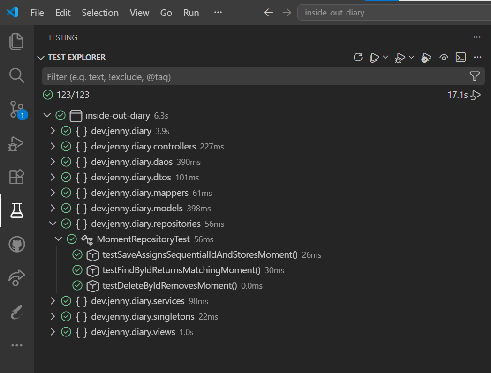<br>**Repositories**         |
|                   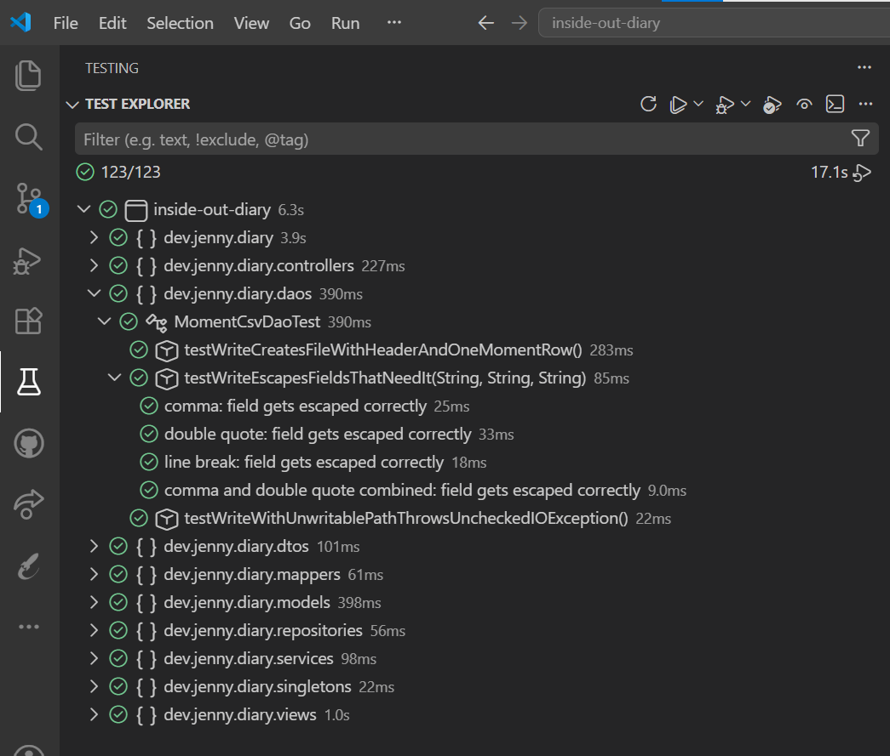<br>**Daos**                    |       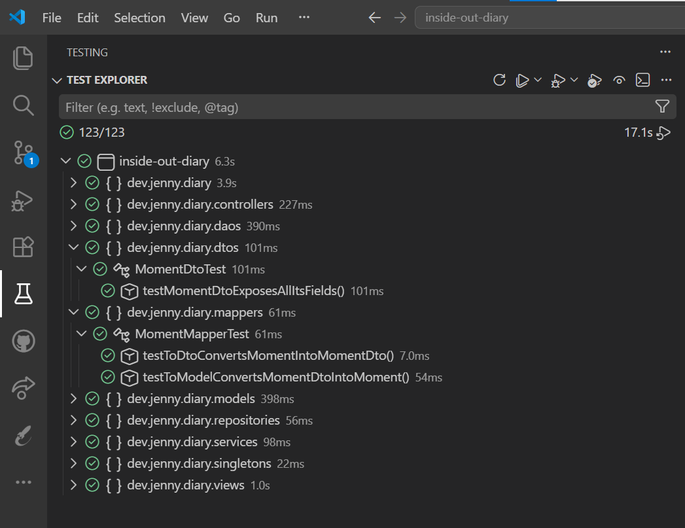<br>**Dtos & Mappers**       |
|       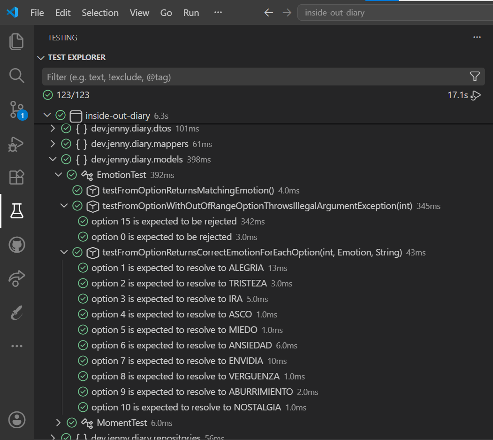<br>**Models · Emotion**       |          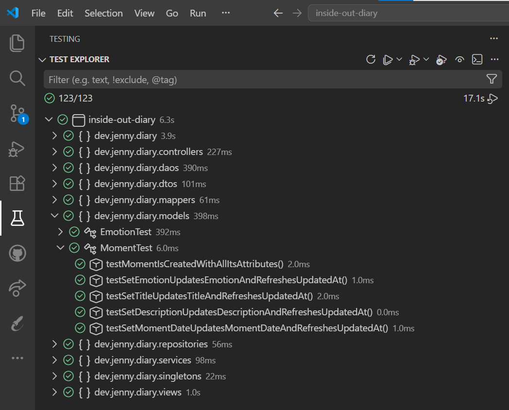<br>**Models · Moment**          |
|          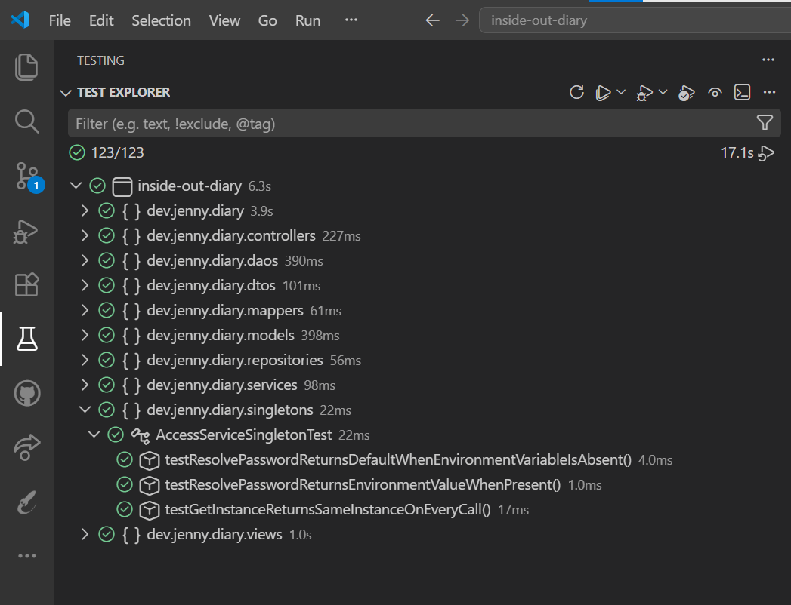<br>**Singletons**           |                                                                                                         |

</details>

| Capa           | Tests | Enfoque                                                             | Herramientas                       |
| -------------- | :---: | ------------------------------------------------------------------- | ---------------------------------- |
| `views`        |  44   | Flujo de consola (entradas y mensajes)                              | JUnit 5 + Hamcrest + Mockito       |
| `singletons`   |   3   | Devolver siempre la misma instancia compartida                      | JUnit 5 + Hamcrest + Mockito       |
| `controllers`  |  11   | Coordinar la vista con el servicio a través de DTOs                 | JUnit 5 + Hamcrest + Fakes propios |
| `dtos`         |   1   | Los datos que viajan entre capas                                    | JUnit 5 + Hamcrest                 |
| `services`     |  20   | Añadir, modificar, eliminar y filtrar momentos, y validar el acceso | JUnit 5 + Hamcrest + Fakes propios |
| `mappers`      |   2   | Convertir cada momento entre modelo y DTO                           | JUnit 5 + Hamcrest                 |
| `models`       |  18   | Validaciones y comportamiento de cada momento y su emoción          | JUnit 5 + Hamcrest                 |
| `repositories` |   3   | Guardar y buscar momentos en memoria                                | JUnit 5 + Hamcrest                 |
| `daos`         |   6   | Escritura a CSV, incluyendo el caso de fallo                        | JUnit 5 + Hamcrest                 |
| `App` (raíz)   |   2   | Arranque de la aplicación                                           | JUnit 5 + Hamcrest + Mockito       |

Quedan sin testear los constructores de las 9 clases que solo se usan por métodos estáticos (`views` y `App`): nunca se instancian, así que no hay nada real que comprobar ahí.

[Volver al índice](#-índice)

---

## 📊 Cobertura de tests (coverage)

Reporte generado con **JaCoCo** tras ejecutar `mvn test`. El informe HTML se encuentra en `target/site/jacoco/index.html`. El margen que falta en instrucciones, líneas y métodos son los constructores de las 9 clases que solo se usan por métodos estáticos (`views` y `App`): nunca se instancian, así que JaCoCo los cuenta como sin cubrir.


| Métrica       | Cobertura |
| ------------- | :-------: |
| Instrucciones |   98 %    |
| Ramas         |   100 %   |
| Líneas        |   98 %    |
| Métodos       |   92 %    |

<details>
<summary>Ver desglose por paquete</summary>

| Paquete                  | Instrucciones |   Ramas   |  Líneas  | Métodos  |  Clases   |
| ------------------------ | :-----------: | :-------: | :------: | :------: | :-------: |
| `views`                  |     94 %      |   100 %   |   95 %   |   74 %   |   100 %   |
| `services`               |     100 %     |   100 %   |  100 %   |  100 %   |   100 %   |
| `models`                 |     100 %     |   100 %   |  100 %   |  100 %   |   100 %   |
| `dev.jenny.diary` (raíz) |     100 %     |   100 %   |  100 %   |  100 %   |   100 %   |
| `daos`                   |     100 %     |   100 %   |  100 %   |  100 %   |   100 %   |
| `controllers`            |     100 %     |     —     |  100 %   |  100 %   |   100 %   |
| `singletons`             |     100 %     |   100 %   |  100 %   |  100 %   |   100 %   |
| `database`               |     100 %     |     —     |  100 %   |  100 %   |   100 %   |
| `repositories`           |     100 %     |     —     |  100 %   |  100 %   |   100 %   |
| `mappers`                |     100 %     |     —     |  100 %   |  100 %   |   100 %   |
| `dtos`                   |     100 %     |     —     |  100 %   |  100 %   |   100 %   |
| **Total**                |   **98 %**    | **100 %** | **98 %** | **92 %** | **100 %** |

</details>

[Volver al índice](#-índice)

---

## 🛠️ Tecnologías

- **[Java 21](https://www.oracle.com/java/technologies/downloads/)** — Lenguaje de programación del proyecto
- **[Apache Maven](https://maven.apache.org/)** — Gestor de dependencias y construcción del proyecto
- **[JUnit 5](https://junit.org/junit5/)** — Framework de tests unitarios
- **[Hamcrest](https://hamcrest.org/JavaHamcrest/)** — Librería de _matchers_ para aserciones legibles (`assertThat`)
- **[JaCoCo](https://www.jacoco.org/jacoco/)** — Medición de la cobertura de tests
- **[Mockito](https://site.mockito.org/)** — Mockeo de dependencias estáticas en los tests de vistas y singletons
- **[Visual Studio Code](https://code.visualstudio.com/)** — Editor usado para desarrollar y gestionar el proyecto
- **[Markdown](https://www.markdownguide.org/)** — Lenguaje de marcado para el README
- **[Git](https://git-scm.com/)** / **[GitHub](https://github.com/)** — Control de versiones y alojamiento del proyecto

[Volver al índice](#-índice)

---

## 📚 Recursos

- **[java.time (Javadoc JDK 21)](https://docs.oracle.com/en/java/javase/21/docs/api/java.base/java/time/package-summary.html)** — Documentación oficial de las clases de fecha y hora de Java
- **[Java User Input (W3Schools)](https://www.w3schools.com/java/java_user_input.asp)** — Guía para leer datos de teclado por consola en Java
- **[Testing System.out.println() (Baeldung)](https://www.baeldung.com/java-testing-system-out-println)** — Guía para testear la salida por consola en Java
- **[java.nio.file (Javadoc JDK 21)](https://docs.oracle.com/en/java/javase/21/docs/api/java.base/java/nio/file/package-summary.html)** — Documentación oficial de la API de archivos de Java
- **[RFC 4180](https://www.rfc-editor.org/rfc/rfc4180)** — Estándar que define el formato de un archivo CSV
- **[OMG UML Specification 2.5.1](https://www.omg.org/spec/UML/2.5.1/PDF)** — Notación oficial de los diagramas UML
- **[Mermaid – Diagram Syntax](https://mermaid.js.org/intro/)** — Documentación de Mermaid para diagramas de secuencia y de clases

[Volver al índice](#-índice)

---

## 👩‍💻 Autora

**[Jenny Sánchez Requejo](https://github.com/Jennydev-25)**

[Volver arriba](#-inside-out-diary--diario-de-emociones-en-java)
